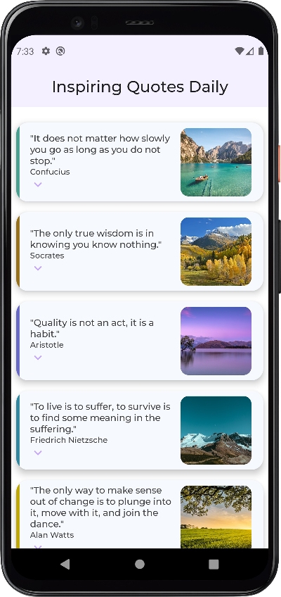

## Table of contents

- [Overview](#overview)
    - [The challenge](#the-challenge)
    - [Screenshot](#screenshot)
- [My process](#my-process)
    - [Built with](#built-with)
    - [What I learned](#what-i-learned)
    - [Continued development](#continued-development)
- [Author](#author)

## Overview

### The challenge

Users should be able to:

- Navigate through the list by scrolling the elements.
- Click and expand each element

### Screenshot

### Links

- Solution URL: [Solution](https://github.com/mlzzi/Project-Create-a-30-Days-App)

## My process

### Built with

- Android Studio
- Kotlin
- Jetpack Compose

### What I learned

In this challenge I applied the knowledge learned in Unit 3 of the training. Important concepts like
scrollable list with LazyColumn and accessing it from a data class. Also I build an expandable Card element
and, at least, I've styled the app and building using Material Theme with Jetpack Compose.

### Continued development

I will continue to learn from the Google's platform and from Jetbrain's platform Hyperskill

## Author

- Linkedin - [Murilo Luzzi](https://www.linkedin.com/in/muriloluzzi/)
- GitHub - [@mlzzi](https://github.com/mlzzi)